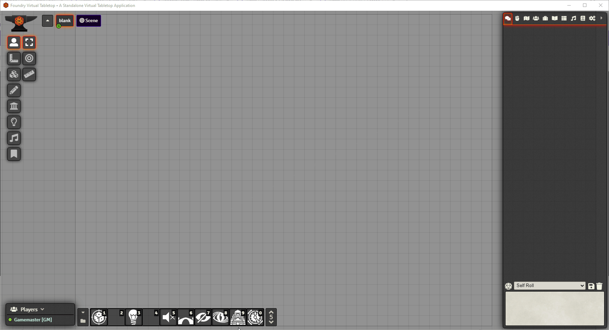

# Roll Credits

## Purpose

A module that attempts to allow the GM to trigger title cards and credit rolls (in progress) similar to what you would see at the beginning and end of a movie or TV program.  It can also be used to show text and images in a slightly fancier way than journals by having them fade in and out.

## Status

VERY early work in progress.  'Title Card' functionality largely working, but requires very specific JSON payload for configuration, with no GUI to assist in building it.  'Rolling Credits' not yet built.  Also changes to how the functions work/behave should be expected.

## Examples/Samples

'Title Card' sample shown below, code used to generate the sample is [here](./scripts/samples/title.js).



Image used under the [Creative Commons License](https://creativecommons.org/publicdomain/zero/1.0/deed.en) and comes from [Pixabay](https://pixabay.com/).

## API

The module works by exposing several functions to call via macros.  For example, to trigger the module to hide the current scene, call the 'blackout' function like so:

```js
game.RollCredits.Blackout(0x008000);
```

Where the one argument is a hexadecimal color code to use for the background.  Blackout can also be called with no parameter, in which case the background is black by default.  The tint parameter is only necessary if a different color such as grey, blue, etc. is desired.

Likewise, the blackout can be removed by calling _removeBlackout_ like so:


```js
game.RollCredits.RemoveBlackout();
```

The full list of API functions is currently:


### StartRollingCredits - [NOT CURRENTLY WORKING]

Have objects scroll down the screen, similar to the ending credits of a movie or television program.

```js
    // will not currently work
    game.RollCredits.StartRollingCredits(config);
```
### StartShowTitleCredits 

Have objects (currently text and images) fade in and out, similar to the title cards at the begining of a movie, or in a trailer for a movie.

```js
    // see sample script for example of how config should look
    game.RollCredits.StartShowTitleCredits(config);
```

### Blackout(tint, zIndex) 

Overlay a solid color rectangle over the canvas, typically in preparation for text/images or for a dramatic way to end a scene.

```js
// Both tint and zIndex are optional.
game.RollCredits.Blackout(0x008000, 1000);
```

### RemoveBlackout 

Strip away the overlayed solid color background if it exists.

```js
game.RollCredits.RemoveBlackout();
```

### ZoomOutToFullCanvas 

Zoom window out to close to maximum to allow seeing objects added to the canvas more easily.

```js
game.RollCredits.ZoomOutToFullCanvas();
```

### SocketDebugMessage 

Debug print a message to both executing window and all connected clients.

```js
game.RollCredits.SocketDebugMessage("Hello to everyone.");
```

### RemoveActiveAnimation

 Attempt to disconnect and delete any active animations or sprites added by API calls.

 ```js
game.RollCredits.RemoveActiveAnimation();
```